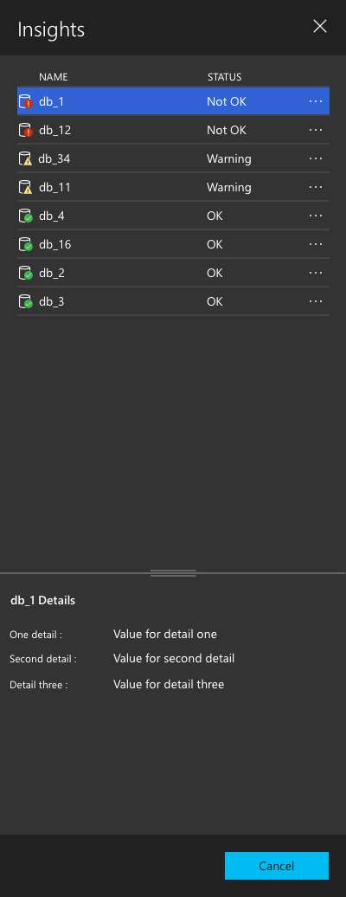
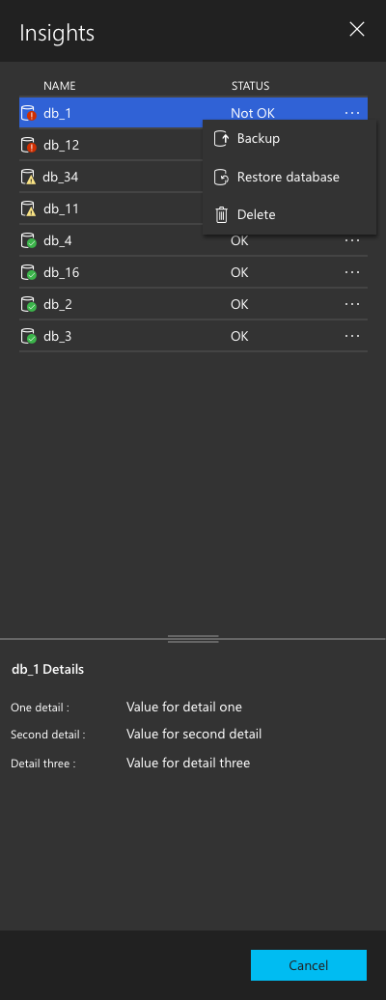

# Controls and patterns for Carbon app

Buttons
======

A button gives the user a way to trigger an immediate action. 

-----------------------------------

#### Is this the right control ?

A button lets the user initiates an immediate action, such as submitting a form.

Don't use a button when the action is to navigate to another page; use a link instead. 

-----------------------------------

#### Example 

In Carbon users see two options - one stands for a primary to the user's task and other, which tends to be less utilized, stands for a secondary task (e.g. allow users to retract the data they've entered in form or to cancel the job).

##### Visual Weight. 
To make clear distinction between two options, you have to use different visual weight for buttons. The buttons with the strongest visual weight will get more attention.

##### Clear and distinct label. 
An explicit label serves as "just-in-time help," giving users more confidence in selecting the correct action. Use a verb whenever possible instead of 'Yes' or 'OK' because it will provide more context.

#### Disabled buttons.
Inactive ( or Disabled) buttons are useful when you need to let the users know that the action is possible, the user has a chance to learn that the option is available.

#### Button interaction.
When you hover over the button, there is a hover background color. When button has keyboard focus, there needs to be a focus background color which is same as hover background color. 

#### Button layout
The primary button that initiates an action is furthest to the right. The Cancel button is to the left of this button.

##### Single button

### Recommended Fix

#### Current implementation:

1. Visual 
    * The primary button needs to have the main color.
    * The secondary button needs to have the muted color.
    * The buttons need to have a disabled state too.

    Would like this to be applied which is not there in VS default theme as of today.

    * export const buttonSecondaryBackground = registerColor('button.secondarybackground', { dark: '#c8c8c8', light: '#c8c8c8', hc: null }, nls.localize('buttonSecondaryBackground', "Secondary button background color."));
    * export const buttonDisabledBackground = registerColor('button.disabledbackground', { dark: '#444444', light: '#eaeaea', hc: null }, nls.localize('buttonDisabledBackground', "Disabled button background color."));
    * export const buttonDisabledForeground = registerColor('button.disabledforeground', { dark: '#888888', light: '#888888', hc: Color.white }, nls.localize('buttonDisabledForeground', "Disabled button foreground color."));

2. The position need to changed

3. The disabled button should have the disabled style applied

4. Don't use a button when the action is to navigate to another page; use a link instead. 

----------------------------

Checkbox
======

A check box is used to select or deselect action items. 

-----------------------------------

#### Is this the right control ?

Use a single check box for a binary yes/no choice, such as with a "Remember me.?" login scenario or with a terms of service agreement.

For a binary choice, the main difference between a checkbox and a toggle switch is that the check box is for status and the toggle switch is for action. 

#### Example 

Unchecked state

Checked state

### Recommended Fix

#### Current implementation:

* On checked state the box needs to have a background color
* The check should be the line icon.

---------------------------------------------

Input control [ Text box and Dropdown box ]
======

### Text box

The TextBox control lets a user type text into an app. 

#### Example

### Dropdown box

The DropDownBox control lets a user choose from the available list of items.

#### Example

### Recommended Fix

#### Current implementation:

Looks like carbon is using what platform provides over here. I think VS Code has also styled this. I would recommend to style it to keep consistent look and feel.

---------------------------------------------

Form 
======

Users should be able to complete forms quickly and without confusion.

#### Example

#### The components for Forms 

* <b>Structure</b> A form is a conversation. 
  * Only have field that is required.
  * Order the form logically expecially in the advance section.
  * Group related information in logical blocks or sets. 
  * Only show what the user needs to know.
* <b> Input fields</b> 
  * Mandatory vs Optional. Clearly distinguish which input fields cannot be left blank by the user. 
  * Setting default value. Use smart defaults which can make the user's completion of the form faster and more accurate. 
  * Autofocusing a field gives the users an indication and a starting point to quickly begin to fill out the form. 
* <b> Field labels </b>
  * Clear label text tells the user the purpose of the field.
  * Labels are not help texts. You should use succinct, short and descriptive labels ( a word or two) so users can quickly scan.
  * Use Title case - e.g. 'First name '
  * Label placement - Top aligned labels make it easier for different sized labels and localized versions to fir easier within the UI. This is especially good for flyout as the size is of a mobile screen with limited estate. The other advantage is quick eye-scan compared to left aligned labels. Exception is when we use toggle button. Just for toggle button I use left aligned with label max size set to 22 characters with ellipsis for overflow. 
* <b> Action buttons </b>
  * Covered in the 'Button' section.
* <b> Feedback </b>
  * User understands the result of the input by a feedback. 
  * Automatic check that ensures that user's data is valid. If invalid the feedback needs to be immediate.
  * Any help that explains how to fill out the form.
----------------

Flyout 
======

### Connection
  <b> Current implementation</b> 
   
  
  <b>Recommended</b> 
  
  When the connection flyout opens. 
  
  
  Rest state
  * Mandatory vs optional is indicated with asterix.
  * Smart defaults are used. 
  * Labels are top aligned.
    
  As soon as the Server name gets focus, show the recent connections. 
  
    
  When a recent connection is selected. 
  
    
       
### Advanced 

  <b>Current implementation</b> 
  
  
  <b>Recommended</b> 
  
  When the Advanced link is clicked. By default the accordian is collapsed. 
  
  
  Only one section is open at a time. The previously opened section closes when the current one is opened.  
  
  
  There is help icon next to each label. Hovering over has a tooltip.  
  

### Input disabled or no input is required

 <b> Current implementation </b>  
 When integrated auth is selected, the input for username and password appears disappeared because labels are still present. 
 
 
 <b> Recommended </b> 
 If an input field is disabled and we want the user to see the values in the disabled control. 
 
 
 If an input field is empty and we are not expecting user to enter any value, just don't show that input field.  
 

### Consistency 

  <b> Current implementation </b>  
  The forms in Connection and New server group have different layout. Need to keep it consistent.  
  
  
  
  
  
 ----------------------
 
Context menu 
======

Context menus display a list of commands or options when the user requests them by left or right click on the ellipsis icon.

##### Ellipsis icon

The ellipsis icon has two states

* It is visible by default on objects which are not hidden like 
	* Server group
	* Insight widgets
	* The row items in the insight flyout.
	* task in task history
* It will appear on hover on objects which are hidden in a tree like
	* Server and its objects

##### Context menu 

 

The context menu can be of following:

* Menu items must have text.
* Menu items can have icons provided the icon well illustrates what the comman does.
* Menu items are grouped logically with primary action one on the top and all secondary actions below the line.
* Menu item text needs to be concise with one or two words. It needs to be mostly verbs.

 ----------------------
 
Insights visualization
======

The Manage dashboard is our home for actionable insights about a user's servers and databases. 

#### Insights categories

Count     
Numerical chart     
Historical Chart  

 
Pie chart  

#### Insights flyout

When a user clicks 'Show insight' on the insight widget, a flyout slides in on the right.

* The top section shows a key value pair.

* The key-value pair are represented in a grid with column name.
* The rows will have the object, an icon that represents the object in different state and the status in text.

* Each row will have a context menu which will list the actions that can be taken on that object.

* bClicking on a particular action will open that task flyout.

* The lower section shows rest of the details for that object.

* By default the top section is about 2/3 size of the content area and the bottom section is about 1/3rd size of the content area.

* By default when the flyout opens, the first object needs to be selected.

More generic insight flyout design 

* If the objects have no icons, then drop the icon and just have text.
* If the text is really long, truncate it at 15 characters and add tool tip.

#### ACCESSIBILITY:

Tab order : Name, Status, Details section and Context menu.

 
    
    

