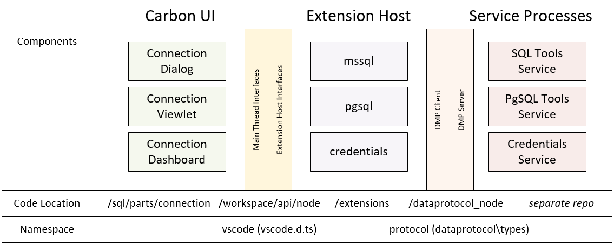
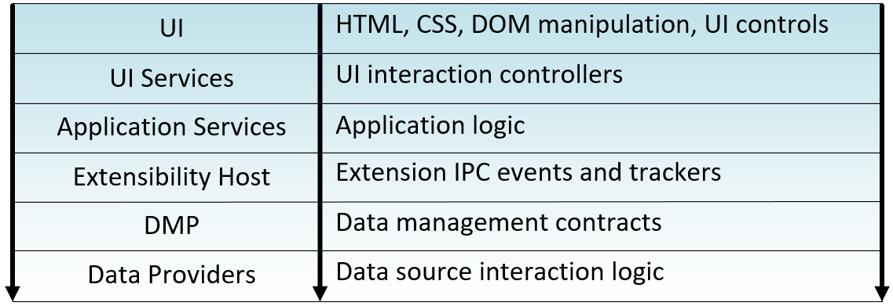

# Carbon Design

Carbon is based on a fork of VS Code 1.9.1 and adopts the code design principles of that code base.
Carbon is built on top of the DMP to allow management of diverse data sources using a data provider
model.

# Connection Management
The connection and server management feature area includes the Connection viewlet, Connection dialog
and the Connection dashboard.  These features work together to allow users to organize their data
source connections and execute commands against those connections.

The following diagram show the core components involved in the connection management experience.  The
components are in either the Carbon UI, Extension Host, or Data Provider Service process.  Most features
will require some implementation in each of these components.

The Carbon application is layered into the following general application areas.  In general the dependencies
should flow downward through the application layers.  Higher-level dependencies should define event interfaces
that allow lower-level components to communicate upward without needing direct dependencies on particular
components.

## Connection Viewlet
The Connection viewlet is the primary UI to browse the list of registered data source connections.
The viewlet provides the following core features.

Feature | Notes
--- | ---
New Connection Profile| Launch the Connection dialog to create a new registered server.
Edit Connection Profile | Launch the Connection dialog to edit an existing registered server.
Delete Connection Profile | Delete the connection profile.
New Group | Create a new connection profile groups.
Edit Group | Edit the connection profile group metadata.
Delete Group | Delete the connection profile group.

The below mock-up shows what the Connection viewlet may look like.

 ## Connection Dialog

The below mock-up shows what the Connection dialog may look like.

 ## Connection Dashboard

The below mock-up shows what the Connection dashboard may look like.

