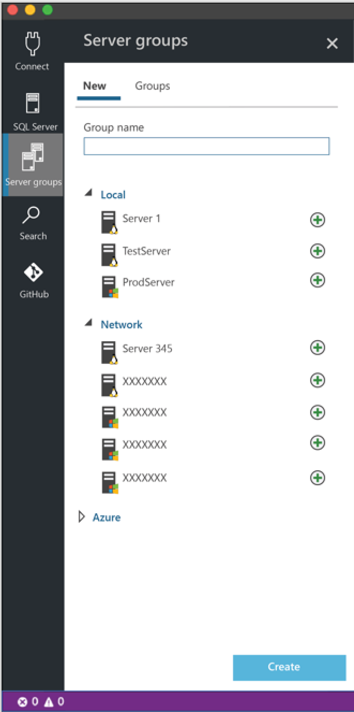
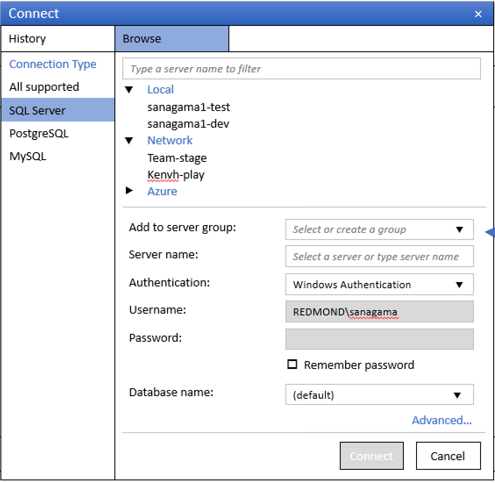
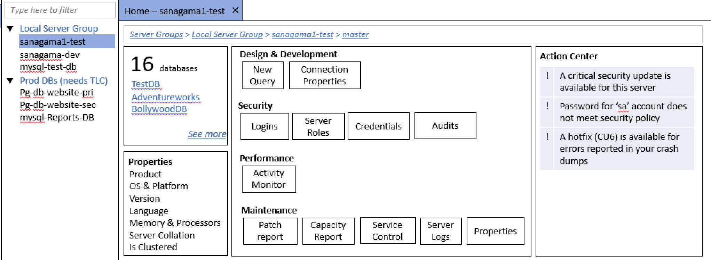

# Carbon Design

Carbon is based on a fork of VS Code 1.8.1 and adopts the code design principles of that code base.
Carbon is built on top of the DMP to allow management of diverse data sources using a data provider
model.

# Connection and Server Management
The connection and server management feature area includes the Connection viewlet, Connection dialog
and the Connection dashboard.  These features work together to allow users to organize their data
source connections and execute commands against those connections.

## Connection Viewlet
The Connection viewlet is the primary UI to browse the list of registered data source connections.
The viewlet provides the following core features.

Feature | Notes
--- | ---
New Registered Server | Launch the Connection dialog to create a new registered server.
Edit Registered Server | Launch the Connection dialog to edit an existing registered server.
Delete Registered Server | Delete the registered server.
New Group | Create a new registered server groups.
Edit Group |
Delete Group |
Add Connection to Group |
Remove Connection to Group |

The below mock-up shows what the Connection viewlet may look like.

 ## Connection Dialog

The below mock-up shows what the Connection dialog may look like.

 ## Connection Dashboard

The below mock-up shows what the Connection dashboard may look like.

