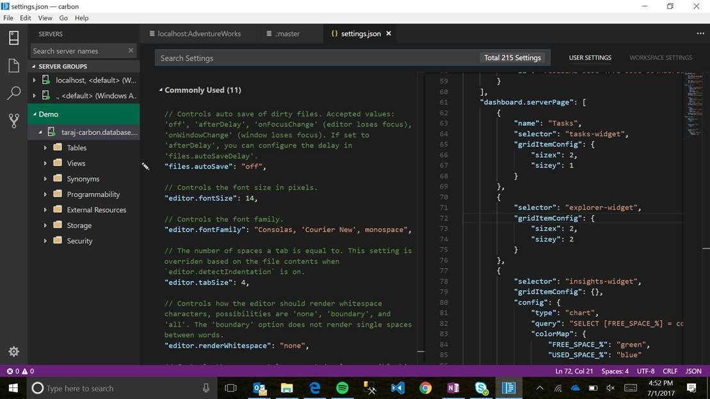

# Custom Server Widget
In this guide you will learn how to create a custom server widget in the Carbon management dashboard.

## Server Dashboard Insights
-	Open Carbon and go to File --> Preferences --> Settings which will open up the settings.json file in two panes:
 
-	Scroll down to the part of the file titled “Server Dashboard Page (1)”
 
-	Click in the left side of the file and select “Replace in Settings”
 
-	Now in the settings.json file in the right you can edit the “insights-widget.” Here are some editing options:
	- Type – count or chart. Start by changing “count” to “chart” and go to a server management dashboard to view the change. Your numbers will now appear as a pie chart.
	- Query – add any T-SQL query of your choice. Pictured above, I have one for disk space. Be sure to create variables for what you would like to appear on the dashboard ([FREE_SPACE_%] is mine above)
	- colorMap – select the colors that you would like for your chart. Use the variable names from your query as labels (it must match the query variable exactly). Some colors you can choose from are red, blue, green, black and white.
-	Go to your management dashboard and view the widget you just created by clicking on a server!
 
-	Go forth and create your own widgets! Let us know what widgets you decide to create – email taraj@microsoft.com and share your query and creations to help us build out the insights portion of the dashboard!