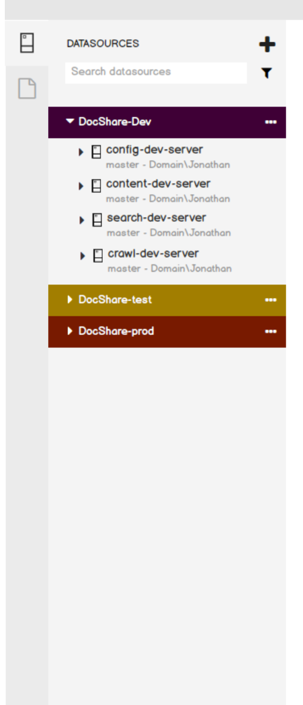

# Carbon Getting Started - Focus on DBA

(Intial draft)

The purpose of this document is to provide a reference model for DBA with a story and role who's building a new online application service project in a team. The goal is to use it as a reference model to design, develop and test Carbon.

This model is based on Sharepoint 2016 [reference] and its DBA guide which describes the following in full detail; SQL Server and database plan, develop, test, deploy and operation. Success criteria for Carbon is to be able to perform required DBA tasks using Carbon with a conjunction with other tools (e.g top or perfmon etc) if necessary to effectively complete the end-to-end flow from Dev to Test staging to Production.

> Note: The content of DBA reference model based on Sharepoint 2016 and its database plan guide. This document **is not** intended to provide a best practice for Sharepoint **nor guarantee the accuracy** of server and database configurations. It should be used as a **sample reference model for tools design purpose only**.

## DBA Story - World-Wide Importers DocShare Service
----
World Wide Importers Co. plans to launch a new employ collaboration and document sharing service for its 10,000 employees called DocShare inspired by Sharepoint. WWI has employees across world including US, Europe and Asian. The service will be first launched in US and be expanded to Europe and Asia data centers afer measuring its success in US.

As a SQL Server DBA, I am responsible to drive planning for database configuration, capacity, recovery and high availability requirements. Then key tasks in my role includes developing deployment scripts, test and verify baseline performance with a set of workload tests. Once it is satisfactory I drive the deployment of server and databases to production env as a part of the service launch orchestration.

After DocShare service goes live, I am responsible to operate the production servers by monitoring and managing performance, capacity, deploy updates, availability, recovery of any data issue and service issues at the SQL server and database level.


### Specifications: Database Configuration, Capacity, Recovery and HA Plans
----
Goals:
* Using the following database configuration, capacity, recovery and HA plans, **develop database deployment scripts**, **backup scripts**, **schedule necessary jobs** and **enable high availability (HA)** on the participating prod servers.

* Using the developed scripts, **provision test and prod environments** in US datacenter initially and later for the planned service expansion to Europe and Asia data centers.

* **Test and verify server and database proisioning, performance, recovery and HA on test staging** before making the final decision to deploy DocShare databases to prod env.

* **Operate prod env** for DocShare service to maintain the service quality requirements for availability, recovery, performance and capacity.

This section describes the specification for the following databases.

* DocShare Content & Collaboration Service
	* Central Admin Database
	* Config Database
	* Content Database

* DocShare Search Service
	* Search Admin Database
	* Analytics Reporting Database
	* Crawl Database
	* Link Database

#### Central Admin Database
----
|Category|Description|
|:-------------|:---------------------------------------------------------------------------------------|
|Name| CentralAdminDB|
|Purpose|Stores all configuration data for Central Administration site collection.|
|Host Name|Prod: ds4-sqlprod1.west-us.wwi.net <br> Test: ds5-sqltest1.west-us.wwi.net <br> Dev: ds6-sqldev1.west-us.wwi.net|
|Host Machine Specs|Company standard specs for Prod, Test and Dev machines|
|OS|Ubuntu 16.04 LTS|
|Database Server Version and Edition| SQL vNext on Linux <br/> (tbd: build scenario for Azure as well)|
|Location Requirement| must be co-located with configuration databases in the same SQL instance|
|Size and growth factor|Intial size: 1GB <br> Max limit: 50GB <br> Growth rate: 64MB|
|Read-Write characteristics|Read-intensive|
|File & Filegroups|PRIMARY, 1 file|
|File location|/mnt/data (RAID10)|
|Scaling method|Scale-up|
|Recovery Model|Full|
|Recovery SLA|2 min|
|Backup Interval Requirements| Full:1 day <br> Differential: 12 hours <br> Transaction Log: 2 min|
|Backup Location|/mnt/backup|
|HA Replicas|<s>2</s> 1 local datacenter secondary|
|HA Replica Hosts| Prod: <br> ds4-sqlprod2.west-us.wwi.net <br> <s>ds4-sqlprod3.west-us.wwi.net</s> <br> Test: ds5-sqltest2.west-us.wwi.net|

#### Config Database
----
|Category|Description|
|:-------------|:---------------------------------------------------------------------------------------|
|Name|ConfigDB|
|Purpose|Stores configuration data for DocShare databases, web applications, templates etc |
|Host Name|Prod: ds4-sqlprod1.west-us.wwi.net <br> Test: ds5-sqltest1.west-us.wwi.net <br> Dev: ds6-sqldev1.west-us.wwi.net|
|Host Machine Specs|Company standard specs for Prod, Test and Dev machines|
|OS|Ubuntu 16.04 LTS|
|Database Server Version and Edition| SQL vNext on Linux <br/> (tbd: build scenario for Azure as well)|
|Location Requirement| must be co-located with the central admin database in the same SQL instance|
|Size and growth factor|Intial size: 1GB <br> Max limit: 50GB <br> Growth rate: 64MB|
|Read-Write characteristics|Read-intensive|
|File & Filegroups|PRIMARY, 1 file|
|File location|/mnt/data (RAID10)|
|Scaling method|Scale-up|
|Recovery Model|Simple|
|Recovery SLA|24 hours|
|Backup Interval Requirements| Simple:1 day|
|Backup Location|/mnt/backup|
|HA Replicas|<s>2</s> 1 local datacenter secondaries|
|HA Replica Hosts| Prod: <br> ds4-sqlprod2.west-us.wwi.net <br> <s>ds4-sqlprod3.west-us.wwi.net</s> <br> Test: ds5-sqltest2.west-us.wwi.net|


#### Content Database
----
|Category|Description|
|:-------------|:---------------------------------------------------------------------------------------|
|Name|ContentDB1 <br> Note: As the service grows, ContentDB will scale-out by adding multiple ContentDBs. |
|Purpose|Stores all user contents such as documents and file for a site. Multiple sites can share the same content database. |
|Host Name|Prod: ds4-sqlprod4.west-us.wwi.net <br> Test: ds5-sqltest4.west-us.wwi.net <br> Dev: ds6-sqldev4.west-us.wwi.net|
|Host Machine Specs|Company standard specs for Prod, Test and Dev machines|
|OS|Ubuntu 16.04 LTS|
|Database Server Version and Edition| SQL vNext on Linux <br/> (tbd: build scenario for Azure as well)|
|Location Requirement|none |
|Size and growth factor|Intial size: 200GB <br> Max limit: 200GB <br> Growth rate: NA|
|Read-Write characteristics|Varies by usage|
|File & Filegroups|Use PRIMARY filegroups only. <br> Create 8 (# of CPU cores) files (possibly in different spindles). Each file size is 200GB/8.|
|File location|/mnt/data (RAID50)|
|Scaling method|Scale-out|
|Recovery Model|Full|
|Recovery SLA|2min|
|Backup Interval Requirements| Full: 1 day <br> Differential: 6 hours| Transaction-Log: 2 min|
|Backup Location|/mnt/backup (RAID10)|
|HA Replicas|<s>2</s> 1 local datacenter secondaries|
|HA Replica Hosts| Prod: <br> ds4-sqlprod5.west-us.wwi.net <br> <s>ds4-sqlprod6.west-us.wwi.net</s> <br> Test: tbd|

#### Search Databases
----
##### Search Admin Database
|Category|Description|
|:-------------|:---------------------------------------------------------------------------------------|
|Name|SearchAdminDB|
|Purpose|Stores all configurations for Search service and crawl state orchestration and history. |
|Host Name|Prod: ds4-sqlprod7.west-us.wwi.net <br> Test: ds5-sqltest7.west-us.wwi.net <br> Dev: ds6-sqldev7.west-us.wwi.net|
|Host Machine Specs|Company standard specs for Prod, Test and Dev machines|
|OS|Ubuntu 16.04 LTS|
|Database Server Version and Edition| SQL vNext on Linux <br/> (tbd: build scenario for Azure as well)|
|Location Requirement|Should fit to RAM on the server for more efficient end-user query load. Do not co-locate with Crawl database|
|Size and growth factor|Intial size: 50GB <br> Max limit: 100GB <br> Growth rate: 64MB|
|Read-Write characteristics|Eqaul READ and WRITE|
|File & Filegroups|PRIMARY, 1 file|
|File location|/mnt/data (RAID10)|
|Scaling method|Scale-up|
|Recovery Model|Simple|
|Recovery SLA|24 hours|
|Backup Interval Requirements| Simple: 1 day|
|Backup Location|/mnt/backup|
|HA Replicas|<s>2</s> 1 local datacenter secondaries|
|HA Replica Hosts| Prod: <br> ds4-sqlprod8.west-us.wwi.net <br> <s>ds4-sqlprod9.west-us.wwi.net</s> <br> Test: ds5-sqltest8-west-us.wwi.net|

##### Analytics Reporting Database
|Category|Description|
|:-------------|:---------------------------------------------------------------------------------------|
|Name|SearchAnalyticsDB|
|Purpose|Stores the results for usage analysis reports.|
|Host Name|Prod: ds4-sqlprod10.west-us.wwi.net <br> Test: ds5-sqltest10.west-us.wwi.net <br> Dev: ds6-sqldev10.west-us.wwi.net|
|Host Machine Specs|Company standard specs for Prod, Test and Dev machines|
|OS|Ubuntu 16.04 LTS|
|Database Server Version and Edition| SQL vNext on Linux <br/> (tbd: build scenario for Azure as well)|
|Location Requirement|Should fit to RAM on the server for more efficient end-user query load. Do not co-locate with Crawl database|
|Size and growth factor|Intial size: 50GB <br> Max limit: 100GB <br> Growth rate: 64MB|
|Read-Write characteristics|Eqaul READ and WRITE|
|File & Filegroups|PRIMARY, 1 file|
|File location|/mnt/data (RAID10)|
|Scaling method|Scale-up|
|Recovery Model|Simple|
|Recovery SLA|24 hours|
|Backup Interval Requirements| Simple: 1 day|
|Backup Location|/mnt/backup|
|HA Replicas|<s>2</s> 1 local datacenter secondaries|
|HA Replica Hosts| Prod: <br> ds4-sqlprod8.west-us.wwi.net <br> <s>ds4-sqlprod9.west-us.wwi.net</s> <br> Test: tbd|

##### Crawl Database
|Category|Description|
|:-------------|:---------------------------------------------------------------------------------------|
|Name|CrawlDB1 <br> As the service grows, crawl database will scale-out to multiple crawl databases.|
|Purpose|Stores the state of each crawled item.|
|Host Name|Prod: ds4-sqlprod10.west-us.wwi.net <br> Test: ds5-sqltest10.west-us.wwi.net <br> Dev: ds6-sqldev10.west-us.wwi.net|
|Host Machine Specs|Company standard specs for Prod, Test and Dev machines|
|OS|Ubuntu 16.04 LTS|
|Database Server Version and Edition| SQL vNext on Linux <br/> (tbd: build scenario for Azure as well)|
|Location Requirement|Do not co-locate with Search Admin database|
|Size and growth factor|Intial size: 50GB <br> Max limit: 100GB <br> Growth rate: 64MB|
|Read-Write characteristics|READ-intensive|
|File & Filegroups|PRIMARY, 1 file|
|File location|/mnt/data (RAID10)|
|Scaling method|Scale-out by adding a new crawl database per 20 million crawled items.|
|Recovery Model|Simple|
|Recovery SLA|24 hours|
|Backup Interval Requirements| Simple: 1 day|
|Backup Location|/mnt/backup|
|HA Replicas|2 local datacenter secondaries|
|HA Replica Hosts| Prod: <br> ds4-sqlprod11.west-us.wwi.net <br> <s>ds4-sqlprod12.west-us.wwi.net</s> <br> Test: ds5-sqltest11.west-us.wwi.net|

##### Link Database
|Category|Description|
|:-------------|:---------------------------------------------------------------------------------------|
|Name|LinkDB|
|Purpose|Stores the click through information.|
|Host Name|Prod: ds4-sqlprod10.west-us.wwi.net <br> Test: ds5-sqltest10.west-us.wwi.net <br> Dev: ds6-sqldev10.west-us.wwi.net|
|Host Machine Specs|Company standard specs for Prod, Test and Dev machines|
|OS|Ubuntu 16.04 LTS|
|Database Server Version and Edition| SQL vNext on Linux <br/> (tbd: build scenario for Azure as well)|
|Location Requirement|Use separate spindles from other databases.|
|Size and growth factor|Intial size: 50GB <br> Max limit: 100GB <br> Growth rate: 64MB|
|Read-Write characteristics|WRITE-intensive|
|File & Filegroups|PRIMARY, 1 file|
|File location|/mnt/data (RAID10)|
|Scaling method|Scale-out by adding additional Link database per 60 million crawled items.|
|Recovery Model|Simple|
|Recovery SLA|24 hours|
|Backup Interval Requirements| Simple: 1 day|
|Backup Location|/mnt/backup|
|HA Replicas|<s>2</s> 1 local datacenter secondaries|
|HA Replica Hosts| Prod: <br> ds4-sqlprod11.west-us.wwi.net <br> <s>ds4-sqlprod12.west-us.wwi.net</s> <br> Test: ds5-sqltest11.west-us.wwi.net|

#### tempdb

|Category|Description|
|:-------------|:---------------------------------------------------------------------------------------|
|Name|tempdb (system database)|
|Host Name|All servers|
|Location Requirement|Locate on a fast disk on a separate spindle from other databases. Place tempdb to RAID 10 array.|
|Size and growth factor|Intial size: 50GB <br> Max limit: 100GB <br> Growth rate: 64MB|
|File & Filegroups|8 files|
|File location|/mnt/tempdata (RAID10)|
|Scaling method|Scale-up|

### Host - Database Topology Summary
This section is a short summary of host-database topology in DocShare service. Requirements for individual database in the previous specification sections.

#### Production Env
|Host|Role|Hosting Database(s)|
|:------------|:---------|:-----------------------------------------------------------------------------|
|**ds4-sqlprod1.west-us.wwi.net**|Production Primary|CentralAdminDB <br> ConfigDB|
|ds4-sqlprod2.west-us.wwi.net|Production Secondary| |
|<s>ds4-sqlprod3.west-us.wwi.net</s>|Production Secondary||</s>
|**ds4-sqlprod4.west-us.wwi.net**|Production Primary|ContentDB(s) |
|ds4-sqlprod5.west-us.wwi.net|Production Secondary||
|<s>ds4-sqlprod6.west-us.wwi.net</s>|Production Secondary||
|**ds4-sqlprod7.west-us.wwi.net**|Production Primary|SearchAdminDB|
|ds4-sqlprod8.west-us.wwi.net|Production Secondary||
|<s>ds4-sqlprod9.west-us.wwi.net</s>|Production Secondary||
|**ds4-sqlprod10.west-us.wwi.net**|Production Primary|CrawlDB, SearchAnalyticsDB, LinkDB|
|ds4-sqlprod11.west-us.wwi.net|Production Secondary||
|<s>ds4-sqlprod12.west-us.wwi.net</s>|Production Secondary||

#### Test Env
|Host|Role|Hosting Database(s)|
|:------------|:---------|:-----------------------------------------------------------------------------|
|**ds5-sqltest1.west-us.wwi.net**|Production Primary|CentralAdminDB <br> ConfigDB|
|ds5-sqltest2.west-us.wwi.net|Test Secondary||
|<s>ds5-sqltest3.west-us.wwi.net</s>|Test Secondary||
|**ds5-sqltest4.west-us.wwi.net**|Test Primary**|ContentDB(s) |
|ds5-sqltest5.west-us.wwi.net|Test Secondary||
|<s>ds5-sqltest6.west-us.wwi.net</s>|Test Secondary||
|**ds5-sqltest7.west-us.wwi.net**|Test Primary|SearchAdminDB|
|ds5-sqltest8.west-us.wwi.net|Test Secondary||
|<s>ds5-sqltest9.west-us.wwi.net</s>|Test Secondary||
|**ds5-sqltest10.west-us.wwi.net**|Test Primary|CrawlDB, SearchAnalyticsDB, LinkDB|
|ds5-sqltest11.west-us.wwi.net|Test Secondary||
|<s>ds5-sqltest12.west-us.wwi.net</s>|Test Secondary||

#### Dev Env
|Host|Role|Hosting Database(s)|
|:------------|:---------|:-----------------------------------------------------------------------------|
|**ds6-sqldev1.west-us.wwi.net**|Dev|CentralAdminDB <br> ConfigDB|
|**ds5-sqldest4.west-us.wwi.net**|Dev|ContentDB(s) |
|**ds5-sqldest7.west-us.wwi.net**|Dev|SearchAdminDB|
|**ds5-sqldest10.west-us.wwi.net**|Dev|CrawlDB, SearchAnalyticsDB, LinkDB|

#### Common Server settings
* Set MAXDOP to 1 for all production and test servers.


### IO Performance Plan - Spindles, Logical Disk, File Layout
----

* e.g. creation of 8 files for ContentDB (for 8 core host machine)

#### General rules
* Separate database data and transaction log files across different disks.
* tempdb: Average read or write action takes more than 20 ms - separate files across disks or upgrade the disk with faster ones.
* Prioritization - locate higher priority files to faster disk.
	1. tempdb data files and transactions logs files
	2. database transaction log files
	3. Search database files
	4. Database data files


### Security Hardening Plan
----
(TBD)

* Provisioning server and database roles
* Provisioning logins, users and groups
* Configure permission on roles and users

--min-bar--

* Requirements for backup encryption or encryption at rest.
* etc

## Specification: Performance, Recovery and HA in Test env plan
Using the following plan, **verify the performance of DocShare SQL databases** and **create a performance baseline**.

**Monitor performance metrics** while Web app team runs a set of concurrent user access workloads and increase the load.

If there is any performance issue caused by the configuration and capacity plan, revise the plan and update the configuration scripts.


### Monitoring
----
Partner up with DocShare web app team, monitor and verify the performance of DocShare SQL servers and database with a set of workloads defined by DocShare app team. The workload simulates the number of concurrent users at multiple levels.

During the execution of workload and backup test, monitor following and analyze the strategy based on the currnet and project workload.

* CPU
* Memory
* cache/hit ratio
* I/O subsystem

(tbd: prioritization of counters based on the importance and effectiveness)

#### SQL Server Counters to monitor
|Counter|Description|
|:-----------------------|:------------------------------------------|
|General Statistics: User connections| shows the number of user connections running on the host machine running SQL Server. increase of user connection count may cause a performance reduction|
|Databases: Transaction/sec| for baselining and troubleshoot issues|
|Locks: Average Wait Time(ms)|shows the average amount of wait time for each lock request that resulted in a wait|
|Locks: Lock Wait Time (ms)|show the wait time for locks in the last second|
|Lock waits/sec|show the number of locks per second that couldn't be satisfied immediately and had to wait for resources|
|Number of deadlocks/sec|show the number of deadlocks on the computer that is running SQL Server per second. This should be 0.|
|Latches: Average Latch Wait Time(ms)|show the average latch wait time for latch request that had to wait.|
|Latches: Latch Waits/sec|show the number of latch request that couldn't be granted immediately|
|SQL Statistics: SQL Compilation/sec|indicates the number of times the compile code path is entered per second|
|SQL Statistics: Re-compilation/sec|indicates the number of statement recompiles per second|
|Buffer Manager: Buffer hit ratio|shows the percentage of pages that were found in the buffer cache without having to read from disk. This ration should be high for better performance. Increase memory enhances buffer hit ratio|
|Plan Cache: Cache hit ratio|indicates the ratio between cache hits and lookups for plans|

### Physical Server counters to monitor
The sample is Windows OS perf counters. Need to add Linux counter-part as well.

|Counter|Description|
|:-----------------------|:------------------------------------------|
|Processor: %Processor Time:_Total|shows the percentage of time that the process is executing application or operating system processes other than idle. The counter should be kept between 50% - 75%|
|System:Processor Queue Length| shows the number of threads in the processor queue. Make sure the number remains less than two times the number of core CPUs|
|Memory: Available Mbytes|shows the physical memory in megabytes available. Make sure to maintain a level of at least 20% of total available physical RAM.|
|Memory:Pages/sec|shows the rate at which pages are read from or written to disk to resole hard page faults.Makes sure to reamain under 100|

### Disk counters to monitor
|Counter|Description|
|:-----------------------|:------------------------------------------|

(tbd)

## Specification: Production Operations Plan
----

* Revise the database size, growth rate by reviewing the actual and predicted size growth with 20% additional margin for error.

* Maintain a level of 25% available space across disks.

* Detect query performance issues and investigate the cause. Address the issue at the database (e.g. missing index, data fragmentation etc) or report to dev team to address the issue in the query.

(TBD)

## DBA's Guide to perform DocShare tasks using Carbon
----

In this section, we will walkthrough Carbon's functionality to complete tasks for DocShare project requirements described above.

> Note that sample command or script is for demonstration purpose only. The actual command and script may differ in the product implementation.

### Pre-requisites

* DBA's client OS is macOS.

* HW team has delivered the required host machines including Linux OS installation and network setup.
	* The host can be a containers or VMs based. In this reference model, we use physical HW setup.

* Installed SQL Server vNext on each Linux hosts following SQL guide. [add reference]
	```
	sudo apt-get install mssql-server
	```
> design note: Kerborose setup for Windows Auth.

### Install Carbon and extensions

1. Run the following step(s) to install Carbon.
	```
	https://aka.ms/carbon-download
	```

2. Start carbon and install mssql-carbon-sqlha extension to add High Availability features to Carbon by executing following command in Carbon's command palete.
	```
	ext install mssql-carbon-sqlha
	```
	> design note & open suggestion: Carbon targets DBAs, Devs and DevOps as main persona. While HA is one of best practices and often a mandatory requirement, it could be an optional feature for developers. One of Carbon's guiding principle is to deliver a 'light-weight' tool hence we propose deliver persona specific features like sqlha as an extension.

### Prepare Carbon for DocShare project
DocShare requires total 20 host machines (or VMs or Containers) each runs a sql instance, total 20 sql instances across Dev, Test and Prod envs. To efficiently manage the servers, we will manage these groups in Dev, Test and Prod groups.

#### Add server groups

1. Go to Servers viewlet by clicking 'Servers' icon on the action-bar.

	> deisng note: for developers or for Azure SQLDB/DW, the addition can be at database level. In this case the term 'server' is misleading. Can it be '**Data Source**' or something equivalent?

2. Click 'Add group' to open Add Group fly-out dialog.
	* Enter 'DocShare-Dev' as the name of group.
	* Enter the description of group in description input box.
	* Click Add to create a new group.
	* Check 'DocShare-Dev' group is created in the 'Servers' viewlet.
	* You can also click '...' on 'DocShare-Dev' group in the 'Servers' viewlet to select menu for 'Edit' or 'Delete'.

3. Repeat step 2 to add 'DocShare-Test' and 'DocShare-Prod' groups.
	* You can also open settings.json file with 'Perferences | Settings' carbon menu, copy DocShare-Dev group definition and paste in settings.json file then edit the name and description for 'DocShare-Test' and 'Docshare-Prod'.
		> Design note: how to handle group guid?


[todo: add mockup]




#### Add servers

1. Go to Servers viewlet and click 'Add server' in '+' menu to open up Add Server fly-out dialog.

2. Enter required values in the Add Server dialog.
	* Enter 'configdb-dev-server' as the user friendly name.

		> (todo: define the text label for 'user friendly name' on UI.)

	* Enter 'ds6-sqldev1.west-us.wwi.net' for the server name.
	* Select 'SQL Login' for the authentication type.
	* Enter 'your sql login name' for the user.
	* Enter 'your password'.
	* Check on 'Remember Password' if allowed.

3. Click 'Add' and check if 'config-dev-server' is added under 'DocShare-Dev' group.
	* Each server entry shows the **friendly name** or **server name**, **database** (master in this case or default) and the **user name**.

	* You can also 'Edit' or 'Delete' a server profile by running a menu by clicking '...' on each server profile in the Server viewlet.

##### Adding (registering) the rest of 19 servers to Carbon

4. Open settings.json file with 'Preference | Settings' carbon menu, copy 'config-dev-server' server profile, paste then edit following properties to add all dev servers in DocShare-Dev group.

	> design note: Carbon allows adding server profiles in Workspace settings.json file to make the server profiles and groups as a project specific configuration or to share it with project team members who share the workspace via source control.

	* Edit the user friendly name.
	* Edit the server name.
	* Edit username unless it is the same for all dev servers.
	> When carbon makes a connection first time after a server profile is added, carbon will pop-up corresponding authentication dialog to enter the password if the authentication type is SQL Login.

5. Repeat step 4 for the remaining 19 servers by copy and edit server profiles in settings.json. For small number of server profile addition, you may want to use the Add Server UI dialog.

6. If you want to work on multiple client machine, copy the settings.json file and pasted it to the following folder where Carbon is installed.
	```
	/Users/<yourname>/Library/Application Support/Carbon/User/settings.json
	```

[todo: add mockup]

#### Connect

1. Double click on a server profile in Servers viewlet.

	[todo: add mockup]

2. Carbon connects (or ask Password) to the server and show 'Home' page for the server.

	* see Server and Database Home page design for more detail.

	* You can **change the default landing page** in settings.json to switch between Home and T-SQL editor.
	```
	{carbon-landingPage}:"Home" | "Editor"
	```

### Development Tasks

In this section, we will walkthrough the DBA tasks and experience using ContentDB as a sample scenario. The same step appiles to other databases in DocShare project specification.

* Database Configuration and Provisioning

* Login / Role / User Provisioning

* Backup Configuration based on the recovery plan

* Availability Group configuration based on the HA plan.

	> design note: To develop AG configuration, we need replica hosts in Dev env as well. Need to refine the best practice for HA configuration development. e.g. adding 4 more hosts to Dev env?

##### Database Configuration


##### Login / User / Role Provisioning
> design note: add login / user /role requirement in DBA reference. e.g. roles required by DocShare service apps. developer accounts etc.

##### Backup Configuration


##### Schedule Backup Job


##### Testing PITR


##### AG Configuration


##### Testing manual failover


### Test Staging Tasks

* Test stating provisioning

* Workload and Performance tests

* Backup and Restore tests with a recovery fire-drill
	* e.g. PITR ContentDB

* HA tests with a HA fire-drill
	* e.g. manual failover

##### Provisioning Test staging

##### Remote host monitoring

* SQL metrics monitoring

* CPU / Memory / IO monitoring

> design note: the goal for DBA is to be able to successfully get the metrics information. We do not envision Carbon as a comprehensive monitoring tool. Carbon can be used with a conjunction with well-known monitoring tool to help DBA achieve their job.

### Production Operations Tasks

* Production provisioning

* Monitoring health and capacity

* Query performance monitoring and tuning

* Security operations


## References
(todo: add actual links for references)
* Sharepoint 2016 DBA guide
