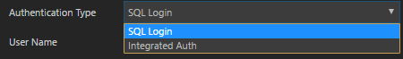

# Guidelines for Flyout Dialog

All flyout dialogs in Carbon should consist of 3 parts: header, body, and footer.

Except Add Server Group and Connectin dialog, Dialog Header should contain the server and database context. Otherwise, it is not clear against what target the Task is being executed once the fly out pops out. The format should be \<Task name\> \<Server name\> or \<Task name\> \<Server name\> | \<database name\>.

For example: Backup Database dialog should contain "Backup Database on \<Server name\> | \<database name\>".

The body part should contain the common controls and have a vertical scroll bar if the content overflows. It should be implemented by either injecting angular or using dom manipulation.

The common flyout code is in src\sql\parts\common\flyoutDialog folder. The common styling for flyout and controllers is in src\sql\parts\common\flyoutDialog\media\flyoutDialog.css. Please use the class names that are in flyoutDialog.css. The diagram below show CSS for dialogs that are created through DOM manipulation and angular component.

Left: CSS for DOM manipulated dialog, Right: CSS for angular component dialog

Connection flyout dialog:

# Theming
The dialog and controls should work with all theming. It should use IThemeService from 'vs/platform/theme/common/themeService'. If you use dom manipulation, all controls should apply styling from 'vs/platform/theme/common/styler'. Please verify with 3 themes: light, dark, and high contrast.

For the full details about theming, please refer to theming guidelines.

# Accessibility
- User should be able to complete the task using only keyboard
- Use tab and ctrl+tab to navigate through the dialog
- Esc key should close the dialog
- Enter key should submit and close the dialog

# Error handling
The dialog should check for the required and valid inputs. If it is in the error stage, the input box will have a red border and contain the error message. The error message consists of error icon and error message. It will show below the form. For synchronized task, if there is an error from the engine after the form is submited, an error dialog should be shown. In the error dialog case, IErrorMessageService should be used.

- Error from input validation

	

- Error from the engine

	

# Common Controls
Most flyout body contains the common controls. The styling for common controls should define in src\sql\parts\common\flyoutDialog\media\flyoutDialog.css.

 ### OK/Cancel buttons
 All footer's buttons is blue color and white text. The selected stage should have white border.

 ### dropdown inputs
 When it is selected, it should have blue border.

 ### Input box
 When it is selected, it should have blue border.

 ### Checkbox
 When it is selected, it should have blue border.

