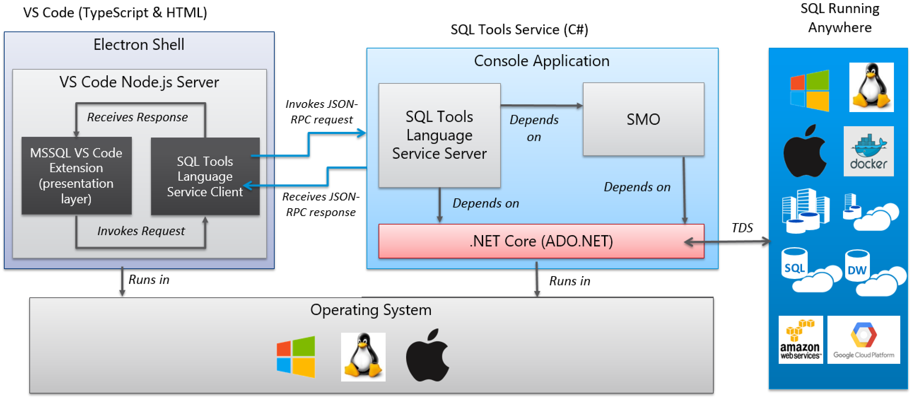

# Carbon Introduction

Carbon is a multi-OS, multi-DB data management tool that is built using the [DMP](../dmp/index.md).
The below diagram illustrates how the vscode-mssql extension uses the SqlToolsService and .Net Core
to provide multi-OS data management.  Carbon extends this model by adding support for additional
tools service components that conform to the DMP protocol.

