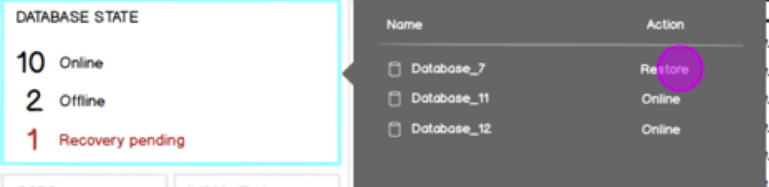

# Manage Dashboard - Insights Widget Extensibility spec

## Executive Summary
The Manage Dashboard is our home for actionable insights about a user’s servers and databases. This spec covers the engineering approach to building an extensible dashboard framework. The primary goal is to build data-driven, reusable UI components that map to the most common visualization categories. We will then engage with partners in DS and our external community to build additional examples in these categories.

### Goals

* Build an initial set of useful insights to ensure viability & usefulness of the dashboard feature
* Scale out our implementation ability by leveraging internal partners and the community
* Provide our first proof-of-concept extension point for the community, where no DMP implementation is needed
* Gain at least 1 internal and 1 external community contribution to Carbon

### Non-Goals
* Core engineering will not attempt to develop every Insight on the dashboard. Our focus is building the common enabling widgets to display most common actionable insights
* We will not implement any live-updating widget (for now)

### Engineering Approach
To support our goals, engineering will prioritize implementation of different insight categories rather than implementing multiple widgets of the same kind. We will then engage with others to build out more insights without the need for the core team to build them.

Most insights can be described by some tabular data and represented using basic operators over this (e.g. count unique column values, convert to chart inputs). This lends itself well to simple data inputs describing the queries to extract the data, how to map (e.g. columns to show) and available actions to launch.

The backing model should be simple enough that JSON definitions can be used for many insights. A best practice from VSCode is to support JSON-based contribution points such as code samples. This has proved very popular with users since the barrier to implementation is much lower than when writing full extensions, and it’s often possible to simply add a .json file to your workspace and benefit: no coding necessary.

### Community Engagement
Database Management users are a passionate & engaged community, but up until now the level of community engagement in extension development, customization etc. has been lower than for developer tools. A key reason may be that these users are often less focused on advanced programming skills, but instead knowledgeable in writing SQL, and the larger operational side of their org.

We propose an experiment:
* We will provide an extension point that only requires knowledge of T-SQL and ability to fill in a JSON template.
* With this, anyone familiar with T-SQL code can write a dashboard extension.
* We will also allow loading of a JSON file for Insights so that users can rapidly prototype / have their personal insights, while supporting extension definitions so they can be shared and published for use by everyone.

Our goal is to gain at least 1 insight shipped in Carbon that’s delivered by the community, and another 1 delivered by a partner inside the DS org.

##Insight Categories & Visualizations

### Basic flow
Insights will have the following pattern as recommended by UX:



Per this example, the flow is:  Summary view -> Details with Action -> Launch action.

### Insight Categories
We have identified a few common categories, listed below. We will engage with PM to map our insights to categories, and find additional categories as necessary

|Category|Visualization Type|Inputs|Examples|
|:-------|:-----------------|:-----|:-------|
|Count|Numbered list|Count: 2 or 3 column with name, count value, optional color code|Backup status: <br>3 DBs OK<br>4 DBs not backed up in 1 week<br>5 DBs never backed up ||
Numerical Chart|Any chart (Pie / Bar etc.)|2 or more column input: X axis is column 0, Y axis is column 1, Additional columns may be used for multiple Y-axis inputs|Free disk space (Pie)  Failed agent jobs (Bar)  ||
|Historical Timeline|Timeline chart. Note: Not live-updating|2 or more column input: X axis must map to time series|Resource usage over time ||
|Live events|Timeline Chart **Note: Out of scope for now**|See above|Live Activity Monitor ||


## Engineering approach
The Dashboard has already been designed in an extensible, widgetized fashion. Additional work to support this spec is:

> table

|Task|Subtask|Priority|
|:-------|:-----------------|:-----|
|Implement insights|Support multiple parallel queries for tabular data and display an Insight based on their results|0||
| |Support flyout with detailed info on insight|0||
| |Support launching actions from details flyout|0||
| |Cache query results carbon-side. Initial caching will be per-Carbon session|0||
| |Support Insight Refresh button for stale data|1||
|Define insight in JSON file|Ensure basic widgets can be defined using a simple JSON format|1||
| |Support loading a JSON file from the workspace with these insights defined inside them|1||
| |Produce a sample JSON file that adds an insight to the dashboard|1||
|Define insight extension point|dd an extension point in data.d.ts that allows extensions to register an insight|2 (dependent on community engagement & interest)||
| |Add a sample extension that adds registers an insight.|2||
| |Register some/all 1st party insights as extensions|2||


## Sample: Backup insight definition for count widget
Below is a rough sample of how an Insight object will look.

Key points:
* The only area of complexity are the T-SQL queries. These can be easily tested in the query editor however, so adding these will be a copy&paste effort for the user
* We can provide enums to limit the options for type, provider, and platforms such that the user is guided through these
* We can provide a set of sample actionIds that either require no context, or work with a DB / Server input as their context.

```json
{
    id: "backupStatus",
    type: "count",
    provider: "mssql",
    platforms: "all",
    actionId: "backup.openDashboard",
    detailsQuery:
"
select
        d.database_id,
        max(b.backup_start_date) AS last_backup,
        case
            when (datediff( hh , max(b.backup_start_date) , getdate()) < @condition) then 1 else 0
        end as health_check
    from sys.databases as d
    left join msdb..backupset as b on d.name = b.database_name
    group by d.database_id
",
    countQuery: "
declare @condition tinyint;
SET @condition = 24;

with backupInsight_cte (database_id, last_backup, health_check)
as
(
    select
        d.database_id,
        max(b.backup_start_date) AS last_backup,
        case
            when (datediff( hh , max(b.backup_start_date) , getdate()) < @condition) then 1 else 0
        end as health_check
    from sys.databases as d
    left join msdb..backupset as b on d.name = b.database_name
    group by d.database_id
)
select
    sum(health_check) Green,
    sum(case when health_check = 0 AND last_backup IS NOT NULL then 1 else 0 end) Yellow,
    sum(case when health_check = 0 then 1 else 0 end) Red
from backupInsight_cte
"
}

```

Here is the basic format for any Insight definition. Note: this is expected to change as the feature is written
```js
// Sample definition of Insight code definition. Will be defined in a simple rule so JSON file
// can have valid options enforced per VSCode standards
export interface Insight {
    id: string;
    type: string;           // e.g. [ Count | Chart | Timeline]
    provider: string;       // e.g. MSSQL, PGSQL
    platforms: string[];    // e.g. [SQL2016, SQL 217, Azure SQL DB]
    actionId: string;       // Optional actionID to launch from the details flyout
    icon?: enum;             // Allow the user to choose one of a preset number of icons?
}

export interface CountInsight extends Insight {
    // SQL query for count summarization. Returns 2 or 3-column view with a name, count, and optional color
    // which is used as label color
    countQuery: string;
    // SQL Query for full details. See details flyout for more info
    detailsQuery: string;
}
```

## Timelines

|Sprint #|Planned work|
|:---|:-----|
|16 (6/5-6/23)|Create 1st Count Insight: Backups Overdue <br> Create flyout <br> Launch task from flyout|
|17 (6/26 – 7/14)|Create 1st Chart Insight (Pie Chart): Disk space used <br>Create 2nd Chart Insight (Bar Chart): TBD<br>Create a Timeline insight: TBD <br>Implement JSON format support, loading from this & providing error handling for definition|
|18 (7/17- 7/30)|“Hackweek”: Drive internal & external team to deliver 1 contribution each (or more).<br>Cleanup, fit & finish. Support community & internal extensions|

