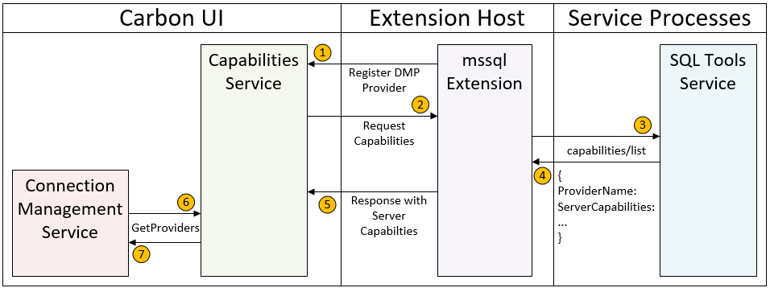
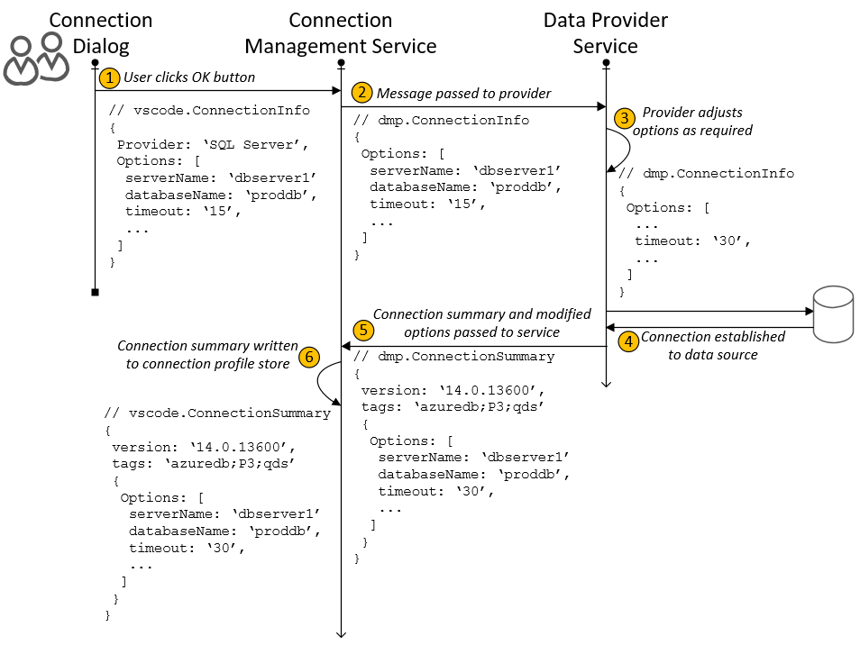
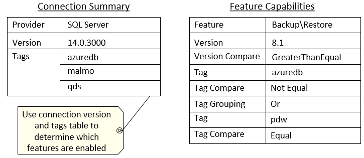

# Capabilities Discovery Protocol
The capabilities discovery protocol messages allow a DMP application to inform the host application
which aspects of the DMP it implements.



The diagram below shows how connection options flow from the Connection Dialog to the data provider service
and then back to the host application.  The data provider service will fill in connection details once a
connection is successfully established.



<br />

The connection summary will provide version and tag details for the current connection.  This metadata will
be filtered against the feature capabiltiies matrix that is built during service initialiation.



## Capabilities Messages

Message | Notes
--- | ---
:leftwards_arrow_with_hook: [capabilities/list](#capabilities_list) | Discover the capabilities a DMP server implements.

### <a name="capabilities_list"></a>`capabilities/list`

List the capabilities implemented by a DMP server.

#### Request

```typescript

    public class DmpClientInfo
    {
        public int? ProcessId { get; set; }

        /// <summary>
        /// The name of the DMP client host application
        /// </summary>
        public string ClientName { get; set; }
    }
```

#### Response

```typescript

    public DmpServerInfo
    {
        public string ServerName { get; set; }

        public DmpServerCapabilities ServerCapabilities { get; set; }
    }

    public class DmpServerCapabilities
    {
        public ConnectionOptions ConnectionProvider { get; set; }

        public bool? QueryProvider { get; set; }

        public bool? EditDataProvider { get; set; }

        public bool? BackupRestoreProvider { get; set; }

    }

    public class ConnectionOptions
    {
        public ConnectionOption[] Options { get; set; }
    }

    public class ConnectionOption
    {
        public string Name { get; set; }

        public string DisplayName { get; set; }

        /// <summary>
        /// Type of the parameter.  Can be either string, number, or category.
        /// </summary>
        public string ValueType { get; set; }

        public string DefaultValue { get; set; }

        /// <summary>
        /// Set of permitted values if ValueType is category.
        /// </summary>
        public CategoryValue[] CategoryValues { get; set; }

        /// <summary>
        /// Determines if the parameter is one of the 'specical' known values.
        /// Can be either Server Name, Database Name, Authentication Type,
        /// User Name, or Password
        /// </summary>
        public string SpecialValueType { get; set; }

        /// <summary>
        /// Flag to indicate that this option is part of the connection identity
        /// </summary>
        public bool IsIdentity { get; set; }
    }
```
