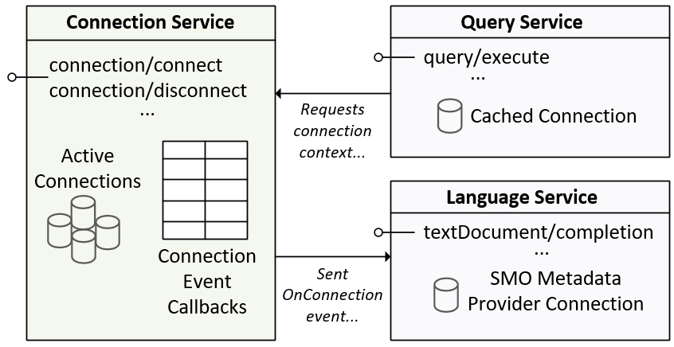

# Connection Protocol
The connection protocol messages provide functionality for save connection administration, connection usage and
connection grouping.

## Connection Messages

Message | Notes
--- | ---
:leftwards_arrow_with_hook: [connection/connect](#connection_connect) | Establish a connection to the specified data source.
:leftwards_arrow_with_hook: [connection/cancelconnect](#connection_cancelconnect) | Cancels a connection request that is in progress.
:arrow_right: [connection/connectionchanged](#connection_connectionchanged) | Connection associated with a particular URI key has changed.
:arrow_right: [connection/complete](#connection_complete) | Connection request is complete.
:arrow_right: [connection/disconnect](#connection_disconnect) | Disconnect the specified connection.
:leftwards_arrow_with_hook: [connection/listdatabases](#connection_listdatabases) | Return a list of databases on a specified server.

### <a name="connection_connect"></a>`connection/connect`

Establish a connection to the data source defined by the ConnectionDetails structure.

Class | Field | Optional | Notes
--- | ---| ---| ---
ConnectParams | OwnerUri | [ ] | Key field used to track the data connection.
ConnectParams | Connection | [ ] | Connection source metadata details used to establish connection.

#### Request

```typescript
    public class ConnectParams
    {
        /// <summary>
        /// A URI identifying the owner of the connection. This will most commonly be a file in the workspace
        /// or a virtual file representing an object in a database.
        /// </summary>
        public string OwnerUri { get; set;  }
        /// <summary>
        /// Contains the required parameters to initialize a connection to a database.
        /// A connection will identified by its server name, database name and user name.
        /// This may be changed in the future to support multiple connections with different
        /// connection properties to the same database.
        /// </summary>
        public ConnectionDetails Connection { get; set; }
    }

    public class ConnectionSummary
    {
        /// <summary>
        /// Gets or sets the connection server name
        /// </summary>
        public string ServerName { get; set; }

        /// <summary>
        /// Gets or sets the connection database name
        /// </summary>
        public string DatabaseName { get; set; }

        /// <summary>
        /// Gets or sets the connection user name
        /// </summary>
        public string UserName { get; set; }
    }

    public class ConnectionDetails : ConnectionSummary
    {
        /// <summary>
        /// Gets or sets the connection password
        /// </summary>
        /// <returns></returns>
        public string Password { get; set; }

        /// <summary>
        /// Gets or sets the authentication to use.
        /// </summary>
        public string AuthenticationType { get; set; }

        /// <summary>
        /// Gets or sets a Boolean value that indicates whether SQL Server uses SSL encryption for all data sent between the client and server if the server has a certificate installed.
        /// </summary>
        public bool? Encrypt { get; set; }

        /// <summary>
        /// Gets or sets a value that indicates whether the channel will be encrypted while bypassing walking the certificate chain to validate trust.
        /// </summary>
        public bool? TrustServerCertificate { get; set; }

        /// <summary>
        /// Gets or sets a Boolean value that indicates if security-sensitive information, such as the password, is not returned as part of the connection if the connection is open or has ever been in an open state.
        /// </summary>
        public bool? PersistSecurityInfo { get; set; }

        /// <summary>
        /// Gets or sets the length of time (in seconds) to wait for a connection to the server before terminating the attempt and generating an error.
        /// </summary>
        public int? ConnectTimeout { get; set; }

        /// <summary>
        /// The number of reconnections attempted after identifying that there was an idle connection failure.
        /// </summary>
        public int? ConnectRetryCount { get; set; }

        /// <summary>
        /// Amount of time (in seconds) between each reconnection attempt after identifying that there was an idle connection failure.
        /// </summary>
        public int? ConnectRetryInterval { get; set; }

        /// <summary>
        /// Gets or sets the name of the application associated with the connection string.
        /// </summary>
        public string ApplicationName { get; set; }

        /// <summary>
        /// Gets or sets the name of the workstation connecting to SQL Server.
        /// </summary>
        public string WorkstationId { get; set; }

        /// <summary>
        /// Declares the application workload type when connecting to a database in an SQL Server Availability Group.
        /// </summary>
        public string ApplicationIntent { get; set; }

        /// <summary>
        /// Gets or sets the SQL Server Language record name.
        /// </summary>
        public string CurrentLanguage { get; set; }

        /// <summary>
        /// Gets or sets a Boolean value that indicates whether the connection will be pooled or explicitly opened every time that the connection is requested.
        /// </summary>
        public bool? Pooling { get; set; }

        /// <summary>
        /// Gets or sets the maximum number of connections allowed in the connection pool for this specific connection string.
        /// </summary>
        public int? MaxPoolSize { get; set; }

        /// <summary>
        /// Gets or sets the minimum number of connections allowed in the connection pool for this specific connection string.
        /// </summary>
        public int? MinPoolSize { get; set; }

        /// <summary>
        /// Gets or sets the minimum time, in seconds, for the connection to live in the connection pool before being destroyed.
        /// </summary>
        public int? LoadBalanceTimeout { get; set; }

        /// <summary>
        /// Gets or sets a Boolean value that indicates whether replication is supported using the connection.
        /// </summary>
        public bool? Replication { get; set; }

        /// <summary>
        /// Gets or sets a string that contains the name of the primary data file. This includes the full path name of an attachable database.
        /// </summary>
        public string AttachDbFilename { get; set; }

        /// <summary>
        /// Gets or sets the name or address of the partner server to connect to if the primary server is down.
        /// </summary>
        public string FailoverPartner { get; set; }

        /// <summary>
        /// If your application is connecting to an AlwaysOn availability group (AG) on different subnets, setting MultiSubnetFailover=true provides faster detection of and connection to the (currently) active server.
        /// </summary>
        public bool? MultiSubnetFailover { get; set; }

        /// <summary>
        /// When true, an application can maintain multiple active result sets (MARS).
        /// </summary>
        public bool? MultipleActiveResultSets { get; set; }

        /// <summary>
        /// Gets or sets the size in bytes of the network packets used to communicate with an instance of SQL Server.
        /// </summary>
        public int? PacketSize { get; set; }

        /// <summary>
        /// Gets or sets a string value that indicates the type system the application expects.
        /// </summary>
        public string TypeSystemVersion { get; set; }
    }
```

#### Response
The message response will contain a bool flag to indicate if the connection request was valid
and was successfully initiated.  A [connection/complete](#connection_complete) message will be
sent when the connection request has been processed.

```typescript
    bool
```

#### Additional Information

> **Note:** The following diagram illustrates how the SqlToolsService uses the connection\disconnection
> messages to create an active connection cache that is shared by various other feature areas.



### <a name="connection_cancelconnect"></a>`connect/cancelconnect`

Cancel an active connection request.

#### Request

```typescript
    public class CancelConnectParams
    {
        /// <summary>
        /// A URI identifying the owner of the connection. This will most commonly be a file in the workspace
        /// or a virtual file representing an object in a database.
        /// </summary>
        public string OwnerUri { get; set;  }
    }
```

#### Response

```typescript
    bool
```

### <a name="connection_connectionchanged"></a>`connection/connectionchanged`

Connection changed notification

#### Request

```typescript
    public class ConnectionChangedParams
    {
        /// <summary>
        /// A URI identifying the owner of the connection. This will most commonly be a file in the workspace
        /// or a virtual file representing an object in a database.
        /// </summary>
        public string OwnerUri { get; set; }
        /// <summary>
        /// Contains the high-level properties about the connection, for display to the user.
        /// </summary>
        public ConnectionSummary Connection { get; set; }
    }
```

### <a name="connection_complete"></a>`connection/complete`

Connection complete event.

#### Request

```typescript
    public class ConnectionCompleteParams
    {
        /// <summary>
        /// A URI identifying the owner of the connection. This will most commonly be a file in the workspace
        /// or a virtual file representing an object in a database.
        /// </summary>
        public string OwnerUri { get; set;  }

        /// <summary>
        /// A GUID representing a unique connection ID
        /// </summary>
        public string ConnectionId { get; set; }

        /// <summary>
        /// Gets or sets any detailed connection error messages.
        /// </summary>
        public string Messages { get; set; }

        /// <summary>
        /// Error message returned from the engine for a connection failure reason, if any.
        /// </summary>
        public string ErrorMessage { get; set; }

        /// <summary>
        /// Error number returned from the engine for connection failure reason, if any.
        /// </summary>
        public int ErrorNumber { get; set; }

        /// <summary>
        /// Information about the connected server.
        /// </summary>
        public ServerInfo ServerInfo { get; set; }

        /// <summary>
        /// Gets or sets the actual Connection established, including Database Name
        /// </summary>
        public ConnectionSummary ConnectionSummary { get; set; }
    }

    public class ConnectionSummary
    {
        /// <summary>
        /// Gets or sets the connection server name
        /// </summary>
        public string ServerName { get; set; }

        /// <summary>
        /// Gets or sets the connection database name
        /// </summary>
        public string DatabaseName { get; set; }

        /// <summary>
        /// Gets or sets the connection user name
        /// </summary>
        public string UserName { get; set; }
    }
```

### <a name="connection_disconnect"></a>`connection/disconnect`

Disconnect the connection specified in the request.

#### Request

```typescript
    public class DisconnectParams
    {
        /// <summary>
        /// A URI identifying the owner of the connection. This will most commonly be a file in the workspace
        /// or a virtual file representing an object in a database.
        /// </summary>
        public string OwnerUri { get; set; }
    }
```

#### Response

```typescript
    bool
```

### <a name="connection_listdatabases"></a>`connection/listdatabases`

Return a list of databases on the server associated with the active connection.

#### Request

```typescript
    public class ListDatabasesParams
    {
        /// <summary>
        /// URI of the owner of the connection requesting the list of databases.
        /// </summary>
        public string OwnerUri { get; set; }
    }
```

#### Response

```typescript
    public class ListDatabasesResponse
    {
        /// <summary>
        /// Gets or sets the list of database names.
        /// </summary>
        public string[] DatabaseNames { get; set; }
    }
```
