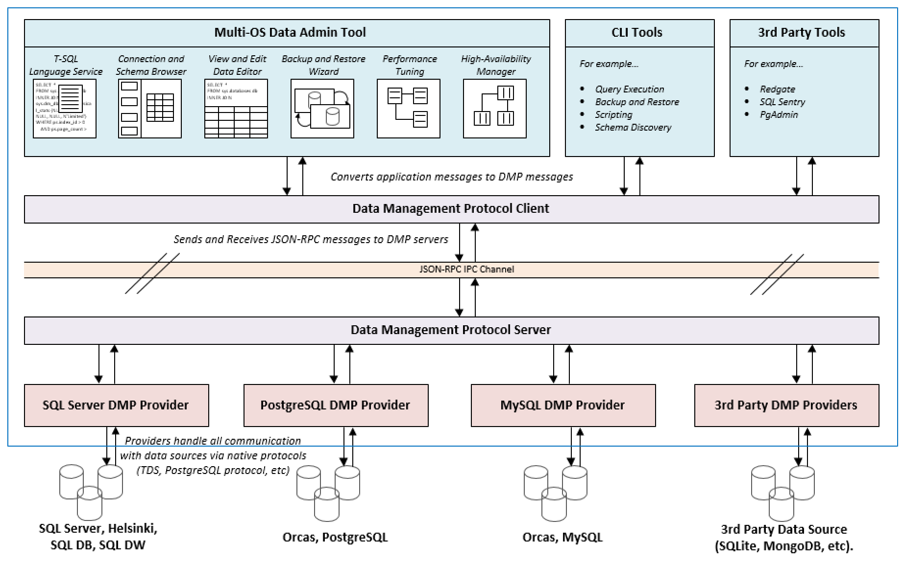

# Data Management Protocol
## Version 0.1
The Data Management Protocol defines a data source agnostic API for building
data management GUI and CLI tools.

The Data Management Protocol Version 0.1 specification documents the JSON-RPC message formats for
implementing the DMP.  The message formats are documenting as interfaces definitions.  The
specification is split into various feature areas to group related functionality.

Feature Area | Notes
--- | ---
[Connection Management](connection.md)| Managing server connections to data sources.
Query Execution| Executing queries, managing resultsets and editing resultsets.
[Language Service](https://github.com/Microsoft/language-server-protocol/blob/master/protocol.md)|Language service features such as auto-completions, diagnostics, go to definition and hover tooltips.

Overview
The following diagram shows how the DMP fits in with GUI\CLI\3rd Party tools and a diverse set
of data source provider service components.  The purpose of the DMP is to provide a decoupling
from various tools and logic to communicate with data sources to accelerate building multi-OS, multi-DB
data management tooling.

